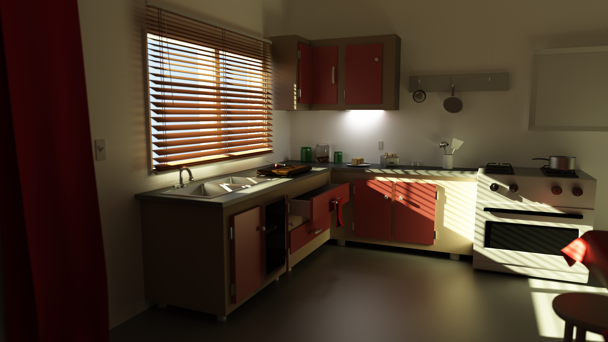

# Polray

## Description
A CPU Monte Carlo renderer written in C++.

### Rendering methods
* Path tracing
* Light tracing
* Bidirectional path tracing using multiple importance sampling

### Spatial subdivision
* KD-Tree constructed in linearithmic time using the Surface Area Heuristic

### Lights
* Area lights
* Sphere lights
* Mesh lights
* Environment lights

### Materials
* Isotropic Ashikhmin-Shirley
* Phong
* Lambertian
* Dielectric
* Mirror

### Cameras
* Pinhole camera
* Thin-lens camera

### Shapes
* Spheres
* Triangles
* Csg objects (can be combined with union/difference/intersection):
  - Cuboids
  - Cylinders
  - Spheres
* .obj files supporting a subset of the Wavefront .obj standard

## Comparison of rendering methods
I spent an inordinate amount of time ironing out the typical subtle math bugs associated
with Monte Carlo rendering in an attempt to make the three rendering methods produce the same
output. The outcome of that effort can be judged from the following .png which hopefully
animates in the browser.

